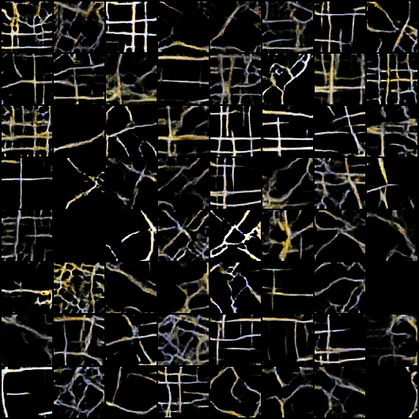

Thining_Algorithm

在做道路网络的图像处理时，需要将生成器得到的图像进行矢量化raster->vector

可以明显的看出，首先的问题是颜色深浅的不一致，还有就是时断时续的线性道路网络，
1. 首先采用可变阈值的二值化算法进行处理;
2. 再使用腐蚀算法出去零散的像素点，由于图片大小较小，kernel大小的设置作用过于明显，就先放大图像，再腐蚀
3. 在2的基础上，使用膨胀算法，将细道路网络加粗

4. 得到的结果图不太乐观，再次反转并进行二值化
]
5. 在4的基础上，进行细化算法

<b>细化算法</b>

