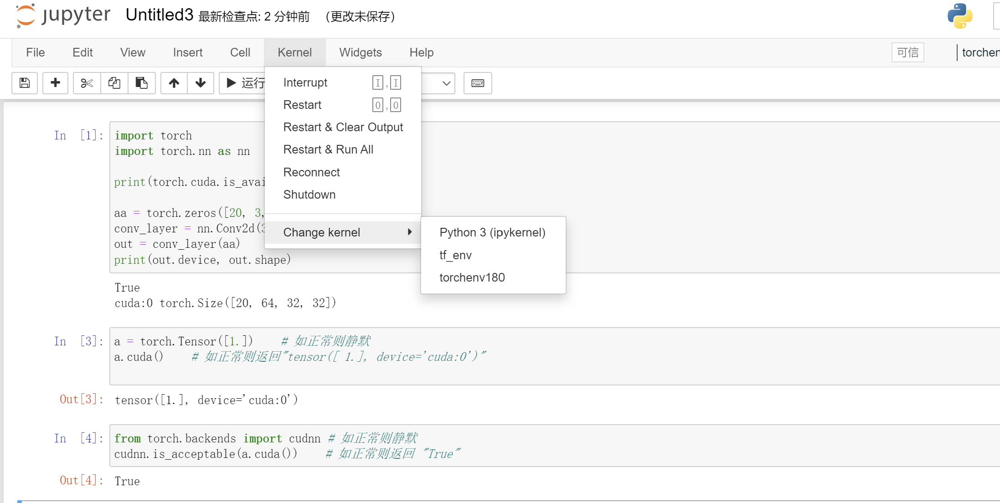

<center><font size='5'><b>深度学习笔记</b></font></center>

<center>materials from : [https://tf.wiki/zh_hans/basic/installation.html]</center>

# Tensorflow 的安装以及环境配置
Windows 用户无法直接创建名为 .condarc 的文件，可先执行 `conda config --set show_channel_urls yes` 生成该文件
如果更换之后报错，提到了源，并发送了report到conda，说明是由于proxy的问题，删除C:\\[username]\\.condarc
```shell
channels:
  - defaults
show_channel_urls: true
default_channels:
  - https://mirrors.tuna.tsinghua.edu.cn/anaconda/pkgs/main
  - https://mirrors.tuna.tsinghua.edu.cn/anaconda/pkgs/r
  - https://mirrors.tuna.tsinghua.edu.cn/anaconda/pkgs/msys2
custom_channels:
  conda-forge: https://mirrors.tuna.tsinghua.edu.cn/anaconda/cloud
  msys2: https://mirrors.tuna.tsinghua.edu.cn/anaconda/cloud
  bioconda: https://mirrors.tuna.tsinghua.edu.cn/anaconda/cloud
  menpo: https://mirrors.tuna.tsinghua.edu.cn/anaconda/cloud
  pytorch: https://mirrors.tuna.tsinghua.edu.cn/anaconda/cloud
  pytorch-lts: https://mirrors.tuna.tsinghua.edu.cn/anaconda/cloud
  simpleitk: https://mirrors.tuna.tsinghua.edu.cn/anaconda/cloud
```
运行 conda clean -i 清除索引缓存，保证用的是镜像站提供的索引。

注意如果需要pytorch, 还需要添加pytorch的镜像

```shell
conda config --add channels https://mirrors.tuna.tsinghua.edu.cn/anaconda/cloud/pytorch/
```
换回conda的默认源。[conda config的文档]:直接删除channels即可。

```shell
conda config --remove-key channels
```

> 使用conda install tensorflow可能不是最新版本

***关于conda install 和 pip install***

```txt
在下载tensorflow时，可以通过pip或者conda命令安装,二者之间的区别？
conda ≈ pip（python包管理） + virtualenv（虚拟环境） + 非python依赖包管理

级别不一样conda和yum比较类似，可以安装很多库，不限于Python。conda是创建一个局部的环境，并安装相应包；pip是安装包到原有的环境中。

pip install会检查一些依赖包并给你安装，而conda的这种检查更多，甚至会把你已有的卸了替换成他认为合适的...反正conda我只是拿来管理，安装一直是pip install...conda install真心不太喜欢乱检测乱适配....

1.pip只能安装python包，而conda可以安装由任何语言编写的包
2.pip不能创建虚拟环境，需要借助另外的包，例如virtualenv,而conda可以创建虚拟环境。
3.pip是按照python时自带的，而conda需要安装anaconda才能用。
pip pip install xxx，在特定环境里使用pip，下载的包会存在特定环境的目录里面，例如：
D:\Anaconda3\envs\nlp\Lib\site-packages\fasttext使用pip uninstallxxx，包就卸载掉了，也可以用
conda remove--name nlp--all 来删除环境
conda conda install xxx，不管在什么环境下载的包，都统一放在一个目录里面：
D:\Anaconda3\pkgs\fasttext这个fasttext里面也有site-packages文件夹
在某个环境下面下载了某个包，再到另外一个环境下载同样的包，conda会自动在上面的目录里面找，如果有，就不会重复下载，而是将这个包的site-packages下的文件复制到当前环境下（和直接pip install一样）使用conda uninstall xxx时，和pip uninstall一样，删除了当前环境site-packages里面的包内容，但是在上述目录里面还存在这这个包，此时再到另外一个环境下载这个包，还是将site-packages复制一份到当前环境下，做到了一次下载，到处使用。
pip是用来安装python包的，安装的是python wheel或者源代码的包。从源码安装的时候需要有编译器的支持，pip也不会去支持python语言之外的依赖项。

conda是用来安装conda package，虽然大部分conda包是python的，但它支持了不少非python语言写的依赖项，比如mkl cuda这种c c++写的包。然后，conda安装的都是编译好的二进制包，不需要你自己编译。所以，pip有时候系统环境没有某个编译器可能会失败，conda不会。这导致了conda装东西的体积一般比较大，尤其是mkl这种，动不动几百兆甚至一G多。

然后，conda功能其实比pip更多。pip几乎就是个安装包的软件，conda是个环境管理的工具。conda自己可以用来创建环境，pip不能，需要依赖virtualenv之类的。意味着你能用conda安装python解释器，pip不行。这一点我觉得是conda很有优势的地方，用conda env可以很轻松地管理很多个版本的python，pip不行。

然后是一些可能不太容易察觉的地方。conda和pip对于环境依赖的处理不同，总体来讲，conda比pip更加严格，conda会检查当前环境下所有包之间的依赖关系，pip可能对之前安装的包就不管了。这样做的话，conda基本上安上了就能保证工作，pip有时候可能装上了也不work。不过我个人感觉这个影响不大，毕竟主流包的支持都挺不错的，很少遇到broken的情况。这个区别也导致了安装的时候conda算依赖项的时间比pip多很多，而且重新安装的包也会更多（会选择更新旧包的版本）。

最后，pip的包跟conda不完全重叠，有些包只能通过其中一个装。
conda可以安装的库都是Anaconda公司或第三方打包、编译，提交到anaconda服务器的，包括一些python库（肯定不全），也包括一些C++的库。可能还有R语言的？

pip就是python官方的包管理。

conda中包括一些C++库，一般都是和python的科学计算有关的。比如可以直接安装这些C++库：

conda install cudatoolkit
conda install mkl
conda install hdf5
当你通过conda安装TensorFlow的时候：

conda install tensorflow-gpu
你就获得了编译链接到cuda和mkl加持的tensorflow库，同时还有编译链接到mkl上的numpy。
```

创建新环境的过程：

```shell
conda create --name tf2 python=3.7      # “tf2”是你建立的conda虚拟环境的名字
conda activate tf2                      # 进入名为“tf2”的conda虚拟环境
```


如何升级pip，首先明确使用的不是系统pip，必须先要进入特定的环境
> pip install --upgrade pip

这里的pipupgrade时，确保必须是虚拟环境的pip，而且大部分情况下会失败(proxy/无权限)，所以关于pip的升级最好使用

>conda upgrade pip

由于在pip upgrade时失败，紧接着用conda upgrade pip，导致pip升级一半并失败(已经下载好，准备删除时，无写入权限)，所以报错

解决方案：conda install -f pip 使用conda强制安装pip

同理，之前在安装tensorflow时中途失败，所以此时依旧会报错，解决方案，删除掉文件夹中以~开始的 文件


python 有python2和python3的区别
那么pip也有pip和pip3的区别：
1、pip是python的包管理工具，pip和pip3版本不同，都位于Scripts\目录下：
2、如果系统中只安装了Python2，那么就只能使用pip。
3、如果系统中只安装了Python3，那么既可以使用pip也可以使用pip3，二者是等价的。
4、如果系统中同时安装了Python2和Python3，则pip默认给Python2用，pip3指定给Python3用。
5、重要：虚拟环境中，若只存在一个python版本，可以认为在用系统中pip和pip3命令都是相同的

接着麻烦事情又来了，下载tensorflow的速度过慢，需要更换pip的源，这一步在windows和Linux中是不同的
临时修改： 
```txt
可以在使用pip的时候在后面加上-i参数，指定pip源 
eg: pip install scrapy -i https://pypi.tuna.tsinghua.edu.cn/simple
```
永久修改： 
linux: 
修改 ~/.pip/pip.conf (没有就创建一个)， 内容如下：
```txt
[global]
index-url = https://pypi.tuna.tsinghua.edu.cn/simple
```
windows: 
直接在user目录中创建一个pip目录，如：C:\Users\xx\pip，新建文件pip.ini，内容如下:
注意，修改的pip是全局的，还是虚拟环境中特定的，按照不同需求更换
```
[global]
index-url = https://pypi.tuna.tsinghua.edu.cn/simple
```
命令行修改源：

```command
chennybaba:~ $ pip3 config set global.index-url https://pypi.douban.com/simple/
Writing to /Users/chenhang_vendor/.config/pip/pip.conf
```

查看当前源：

```command
chennybaba:~ $ pip3 config list
global.index-url='https://pypi.douban.com/simple/'
```
假如在user下换了全局的pip源，可能会导致可移植性差，所以，以后pip都将使用 `-i` 来指定链接的源

> pip install -i https://pypi.tuna.tsinghua.edu.cn/simple [安装包名称]

> pip search 命令被禁用

具体的tensorflow的安装还是要看官网
![https://www.tensorflow.org/install/pip?hl=zh-cn#windows]
其中注意指定为TUNA源，另外还有安装的验证(这个命令行中不知道为何会报错，但是在之后全部配置完之后在ipynb中是正常的)

```shell
python -c "import tensorflow as tf;print(tf.reduce_sum(tf.random.normal([1000, 1000])))"
```

之后再依次下载cuda和 cudnn
下载cuda时注意驱动的版本号，下载之后，进行安装，由于我安装了vs2022，提示没有找到依赖的visual studio 2019环境，但是忽略之后安装依旧成功

***验证cudnn是否安装成功的方法***
在此之前确保将下载好的cudnn的各个目录中的内容放入对应的cuda安装目录的各个部分

首先进入到安装cuda的目录


注意其中的两个可执行文件:
* deviceQuery.exe
* bandwidthTest.exe
首先执行：deviceQuery.exe，查看是否出现如下界面：
然后执行bandwidth.exe，出现如下页面：

此时说明二者都安装成功

发现使用jupyter notebook时无法选择已经创建的环境，所以，需要使得tf2env环境在notebook中正常显示

> conda install -n [name_env] ipykernel

在安装好ipykernel之后，需要指定该环境的kernel名称
> python -m ipykernel install --user --name tf2env --display-name tf_env


测试的py代码
```python
import tensorflow as tf
print(tf.test.is_built_with_cuda())
print(tf.test.is_gpu_available())
```

最后，使用GPU跑一个简单的代码
```python
import tensorflow as tf
gpus = tf.config.experimental.list_physical_devices('GPU')
if gpus:
  # Restrict TensorFlow to only allocate 1GB of memory on the first GPU
  try:
    tf.config.experimental.set_virtual_device_configuration(
        gpus[0],
        [tf.config.experimental.VirtualDeviceConfiguration(memory_limit=1024)])
    logical_gpus = tf.config.experimental.list_logical_devices('GPU')
    print(len(gpus), "Physical GPUs,", len(logical_gpus), "Logical GPUs")
  except RuntimeError as e:
    # Virtual devices must be set before GPUs have been initialized
    print(e)
```

```python
import tensorflow as tf
 
from tensorflow.python.client import device_lib
 
gpu_device_name = tf.test.gpu_device_name()
print(gpu_device_name)
 
 
 
# 列出所有的本地机器设备
local_device_protos = device_lib.list_local_devices()
# 打印
#     print(local_device_protos)
 
# 只打印GPU设备
[print(x) for x in local_device_protos if x.device_type == 'GPU']
```


# Pytorch的安装以及环境配置
和之前的tensorflow一样，先指定一个虚拟环境，然后再在其中进行相关配置

查看所有的env环境及信息
> conda env list
> conda info -e

***conda 重命名环境***
通过克隆一个新的环境，删掉老的环境来解决这个问题。
```cmd
conda create --name python32（新名字） --clone python321（老名字）

conda remove --name old_name --all
```
由于存在有cuda版本和pytorch的不匹配问题，暂时先将其搁置，等到pytorch适配比较完善的版本之后，再下载安装

好了，现在找到了一个解决方案版本，主要是发现实际上不存在cuda11.2，而将cuda11.1作为pytorch的安装方案(https://blog.csdn.net/weixin_43543177/article/details/121495921)，也是可以的，安装如下：

> pip install torchvision==0.9.0+cu111 torchaudio==0.8.0 -f https://download.pytorch.org/whl/torch_stable.html

在安装时，会自动下载pytorch 1.8.0


最后在jupyter notebook中显示该kernel

验证安装成功！

