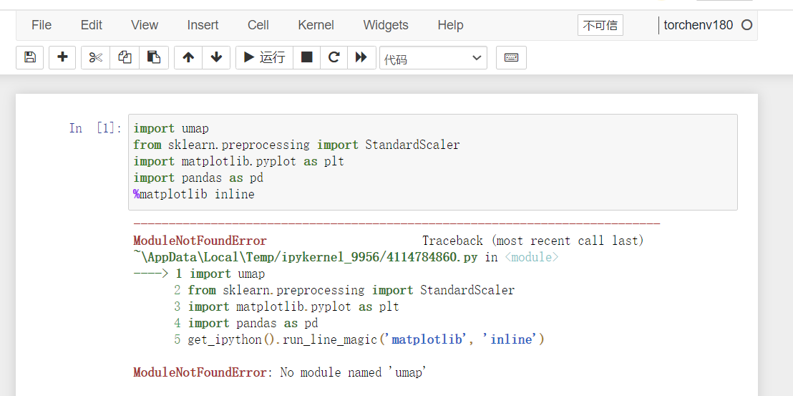
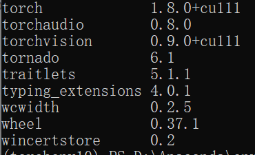

## 在不同的环境中安装包时遇到的问题
使用activate进入环境，并使用命令pip，结果在nb中使用时，发出error

而在base的environment中运行正常，查阅资料后发现：
> 使用anaconda切换虚拟环境后，使用pip安装包时，总是用的base环境的pip，包无法安装到虚拟环境中

解决方案： 在进入虚拟环境后，再进入到特定的目录之下(和pytonexe同级)，执行
> python -m pip install ..

