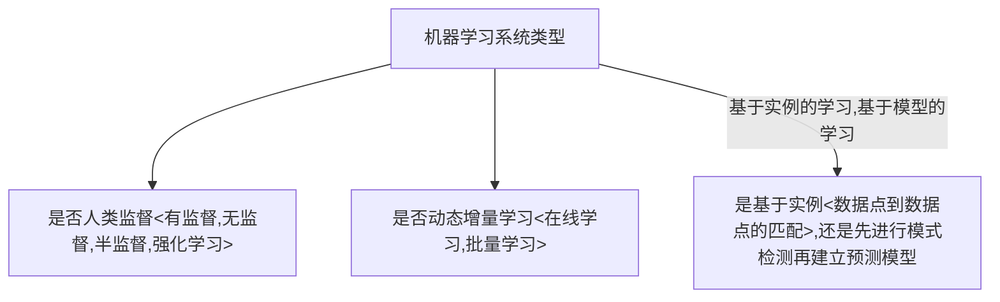
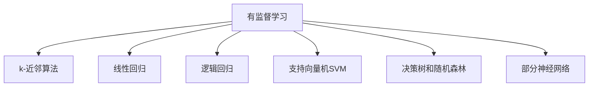
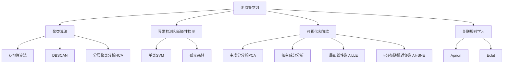

<b>chapter 1</b>

# 机器学习的分类

```mermaid
graph TD;
    A[机器学习系统类型]-->B[是否人类监督<有监督,无监督,半监督,强化学习>];
    A-->C[是否动态增量学习<在线学习,批量学习>];
    A-->|基于实例的学习,基于模型的学习|D[是基于实例<数据点到数据点的匹配>,还是先进行模式检测再建立预测模型]; 
```

## 有监督学习的算法

```mermaid
graph TD;
    A[有监督学习]-->B[k-近邻算法];
    A-->C[线性回归];
    A-->D[逻辑回归];
    A-->E[支持向量机SVM];
    A-->F[决策树和随机森林];
    A-->G[部分神经网络];
```

## 无监督学习的算法

```mermaid
graph TD;
    A[无监督学习]-->B[聚类算法];
    A-->C[异常检测和新颖性检测];
    A-->D[可视化和降维];
    A-->E[关联规则学习];
    B-->B1[k-均值算法];
    B-->B2[DBSCAN];
    B-->B3[分层聚类分析HCA];
    C-->C1[单类SVM];
    C-->C2[孤立森林];
    D-->D1[主成分分析PCA];
    D-->D2[核主成分分析];
    D-->D3[局部线性嵌入LLE];
    D-->D4[t-分布随机近邻嵌入t-SNE];
    E-->E1[Apriori];
    E-->E2[Eclat];
```
